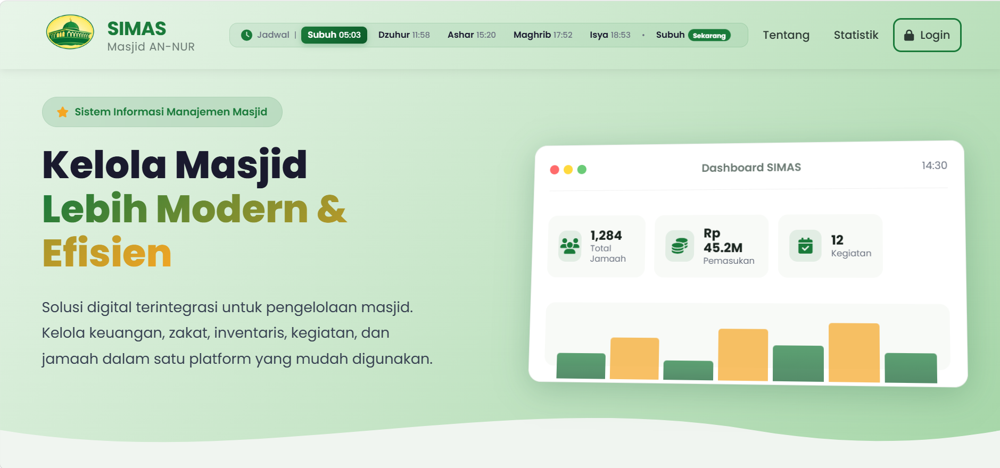

# 🕌 SIMAS - Sistem Informasi Manajemen Masjid AN-NUR

## 📖 Tentang Project

**SIMAS** adalah konsep UI/UX website yang dirancang untuk mendukung pengelolaan administrasi masjid secara modern, efisien, dan terintegrasi. Project ini merupakan tahap awal sebelum dikembangkan menggunakan **Laravel**.

---

## ✨ Fitur

- 📊 Dashboard
- 👥 Manajemen Jamaah
- 📦 Inventaris
- 💰 Keuangan
- 📅 Agenda Kegiatan
- 📑 Dokumentasi
- ⚙️ Dan berbagai fitur lainnya.

---

## 🖼️ Preview

### Dashboard

## 🛠️ Tech Stack

- Laravel
- PHP
- Bootstrap
- JavaScript
- MySQL

---

## 👨‍💻 Developer

**Muhammad Reki**  
D4 Teknologi Rekayasa Komputer  
Politeknik Pertanian Negeri Payakumbuh